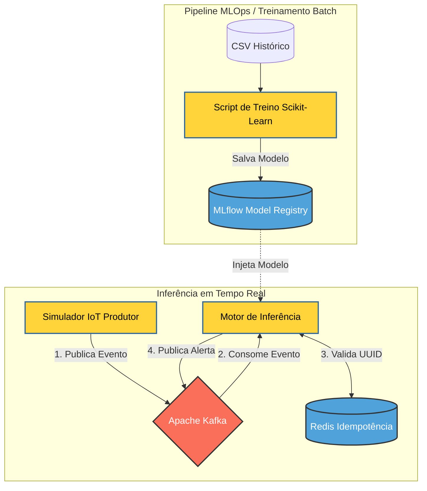

# 🚜 AgroStream: Telemetria e Predição de Estresse Hídrico em Tempo Real

## 📌 Visão Geral
O AgroStream é uma Prova de Conceito (PoC) de uma Arquitetura Orientada a Eventos (EDA) aplicada ao agronegócio de precisão. O projeto resolve um problema crítico: a latência na detecção de anomalias climáticas em estufas, que tradicionalmente operam em batch, gerando perdas irreversíveis na safra.

Este sistema une Engenharia de Dados (Streaming) e Machine Learning Operations (MLOps) para ingerir dados de sensores IoT em alta velocidade, garantir idempotência, e realizar inferências em tempo real para prever o risco de estresse hídrico nas plantas.

## 🏗️ Arquitetura do Sistema

O projeto adota uma estrita Separação de Responsabilidades (SoC), dividindo-se em dois grandes ecossistemas que se comunicam através do Model Registry:

Mundo Offline (MLOps): Responsável por consumir dados históricos, realizar Engenharia de Features, treinar o modelo preditivo (Random Forest) e versionar o artefato no MLflow.

Mundo Online (Streaming): Uma infraestrutura viva (24/7) baseada em Apache Kafka e Redis, onde um produtor simula os sensores IoT e um consumidor avalia as métricas em tempo real gerando alertas de risco.



## 📂 Estrutura do Repositório

```Plaintext
projeto-agrostream-ia-mlops/
├── analyse/                 # Notebooks e scripts de Análise Exploratória (EDA)
├── data/                    # Datasets históricos brutos
├── extracted_features/      # Gráficos e matrizes geradas na análise
├── train_model/             # Pipeline de MLOps e treinamento com MLflow
├── streaming/               # Microsserviços de mensageria em tempo real
│   ├── producer/            # Simulador IoT que publica no Kafka
│   └── consumer/            # (WIP) Motor de Inferência em tempo real
├── docker-compose.yml       # Orquestração da infra (Kafka, Kafka-UI, Redis)
└── requirements.txt         # Dependências do projeto
```

🚀 Como Executar o Projeto

1. Pré-requisitos

Docker e Docker Compose instalados.

``` Python 3.9+ e ambiente virtual (venv) configurado. ```

2. Subindo a Infraestrutura Base

Na raiz do projeto, inicie os serviços de mensageria e cache:

```Bash
docker-compose up -d
Dica: Acesse a interface gráfica do Kafka em http://localhost:8080.
```

3. Pipeline de MLOps (Treinamento)

Instale as dependências e rode o pipeline para gerar o modelo preditivo:

```Bash
pip install -r requirements.txt
python train_model/train_model.py
O modelo será versionado e salvo na base local do MLflow. Você pode visualizar o tracking rodando mlflow ui --backend-store-uri sqlite:///mlflow.db.
```

4. Simulação em Tempo Real (Streaming)

Inicie o simulador IoT para bombardear o Apache Kafka com os dados da estufa a cada segundo:

``` Bash
python streaming/producer/iot_simulator.py
```

🛠️ Tecnologias Utilizadas

Linguagem: Python 3

Machine Learning: Scikit-Learn, Pandas, Numpy

MLOps: MLflow (Tracking & Model Registry)

Engenharia de Dados (Streaming): Apache Kafka (KRaft mode), Confluent-Kafka

Cache/Idempotência: Redis

Infraestrutura: Docker & Docker Compose

👨‍💻 Autor

Pedro Novaes Desenvolvedor de Software.

🔗 [Linkedln](https://www.linkedin.com/in/pedrocnovaes/)
